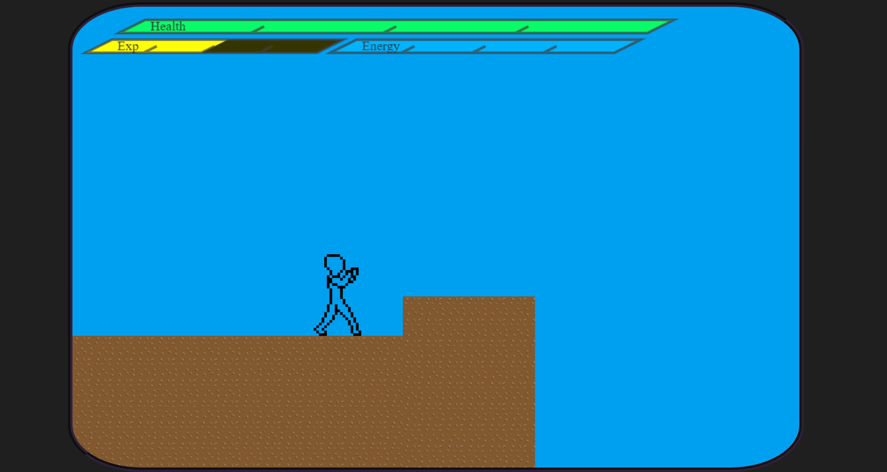

    <h1>Game HTTP</h1>
    

# Sobre o Projeto

Esse projeto tem como premissa a criação de um **jogo de luta multi-jogador** com a renderização no `client-side` e cálculos físicos e lógica no `server-side`, trazendo uma arquitetura simples porem poderosa!

## Ideia inicial

A criação de um jogo é ótimo para testar conceitos e aprender mais sobre sua linguagem de programação, por sorte, a mesma linguagem utilizada no `browser` pode ser utilizada no `server`, sendo ela o `Javascript` que proporciona inumeros recursos que facilitam a vida do programador.

## Tecnologias utilizadas

Nesse README é importanque destacar as tecnologias que foram utilizadas para a criação de um serviço como esse.

    
    
    

